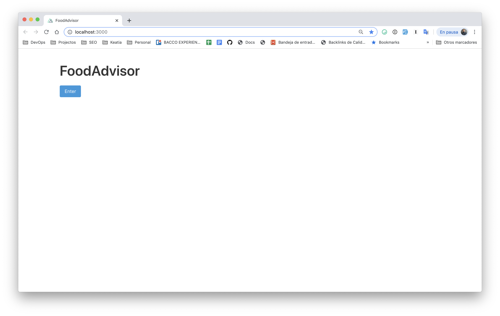

# 📗 Clase 9: Configuración inicial Nuxtjs y Bulma CSS

### Instalando Bulma Css

Para poder usar el frameword de Bulma en nuestro proyecto, empezaremos instalando el modulo ``@nuxtjs/bulma``.

``npm install @nuxtjs/bulma``

Una vez instalado, podemos ver en nuestro fichero **pakage.json** como se ha incluido la dependencia de **bulma**.

```json
  "dependencies": {
    "@nuxtjs/bulma": "^1.2.5",
    ...
  },
```

Tenemos que añadir en nuestro fichero ``nuxt.config.js``, el framework:

```javascript
  modules: [
    '@nuxtjs/bulma'
  ],
```

👍 Ahora tenemos todo listo para poder usar las clases de Bulma en nuestros componentes.

Para comprobar que todo esta correcto y que Bulma Css se ha configurado correctamente, podemos escribir el siguienete código en el fichero **pages/index.vue**

```html
<template>
  <div class="container">
    <section class="section">
      <h1 class="title is-1">
        FoodAdvisor
      </h1>
      <button class="button is-info">
        Enter
      </button>
    </section>
  </div>
</template>

<script>
export default {
  components: {}
}
</script>
<style></style>
```

## Resultado



### 📚 Referencias y ayudas

- [Guía Oficial de instalación Nuxtjs](https://nuxtjs.org/guide/installation)
- [Bulma io](https://bulma.io/)