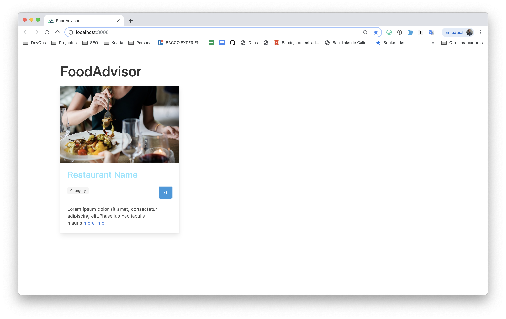

# 📗 Clase 11: Estructura de un componente (*Single File Component*).

### Etiqueta ```<template>```:

Dentro de la etiqueta ``<template></template>`` escribiremos todo nuestro código **html**. Esta etiqueta nos permite además añadir o **bindear** (enlazar), nuestra lógica escrita en *javascript* y darle formato con *css*.

### Etiqueta ```<script>```:

Dentro de esta etiqueta, escribiremos toda nuestra lógica de aplicación o del componente. Lo ideal es implementar solo los *métodos* necesarios para el funcionamiento de ese componente.

Cada *Single File Component* puede retornar un objeto con sus propiedades y métodos. 


### Etiqueta ```<style></style>```:

Aqui definiremos todos los estilos del componente. Podemos definirlos de forma global, pero es posible que otros componentes modifiquen su aspecto si usan los mismos nombres de clase, por lo que **no es recomendable hacerlo**. Lo mejor es definir solo los estilos dentro del *scope* del componente, es decir, si añadimos el atributo **scoped** a la etiqueta, todos los estilos que definamos, solo afectarán a dicho componente.

## 👏 Creando nuestro primer componente:

Vamos a crear nuestro primer componente de nuestro proyecto. Para ello vamos a crear un nuevo fichero dentro del folder `components` al que llamaremos `RestaurantCard.vue`

Como podrás ver más adelante, estamos usando la plantilla de [Bulma CSS](https://versions.bulma.io/0.7.0/documentation/components/card/) para crear nuestro componente **CARD**, pero lo hemos modificado un poco que se ajuste un poco más a nuestro diseño y requerimientos. Por ahora, solo nos interesa que se vea la estructura con algunos datos de prueba.

**Assets/images**: En la carpeta  `assests/images` encontraras el recurso de la imagen destacada.

### Escribiendo nuestro componente `RestaurantCard.vue`:

```html
<template>
  <div class="card" style="width:400px;">
    <div class="card-image">
      <figure class="image">
        
      </figure>
    </div>
    <div class="card-content">
      <div class="media">
        <div class="media-content">
          <p class="title is-4 restaurant-name">
            Restaurant Name
          </p>
          <div class="columns">
            <div class="column">
              <span class="tag">Category</span>
            </div>
            <div class="column has-text-right">
              <button class="button is-info">0</button>
            </div>
          </div>
        </div>
      </div>
      <div class="content">
        Lorem ipsum dolor sit amet, consectetur adipiscing elit.Phasellus nec
        iaculis mauris.<a href="">more info</a>.
      </div>
    </div>
  </div>
</template>

<script>
export default {}
</script>

<style scoped>
.restaurant-name {
  font-size: 30px;
  color: #8ae6ff;
}
</style>
```

Importando nuestro componente en una página de nuxtjs

```html
<template>
  <section class="section">
    <div class="container">
      <RestaurantCard /> <!-- Nuestro componente-->
    </div>
  </section>
</template>

<script>
import RestaurantCard from '~/components/RestaurantCard'
export default {
  components: {
    RestaurantCard
  }
}
</script>

<style></style>

```

Si todo ha ido bien, deberías ver un resultado como este:



### ⚒️ RECOMENDACIÓN:

Te recomiendo que leas y conozcas un poco **Bulma CSS** tiene una documentación muy sencilla y facil de leer. 

### 📚 Referencias y ayudas

- [Bulma io](https://bulma.io/)
- [Single File Components](https://vuejs.org/v2/guide/single-file-components.html)
- [Guía Oficial de instalación Nuxtjs](https://nuxtjs.org/guide/installation)